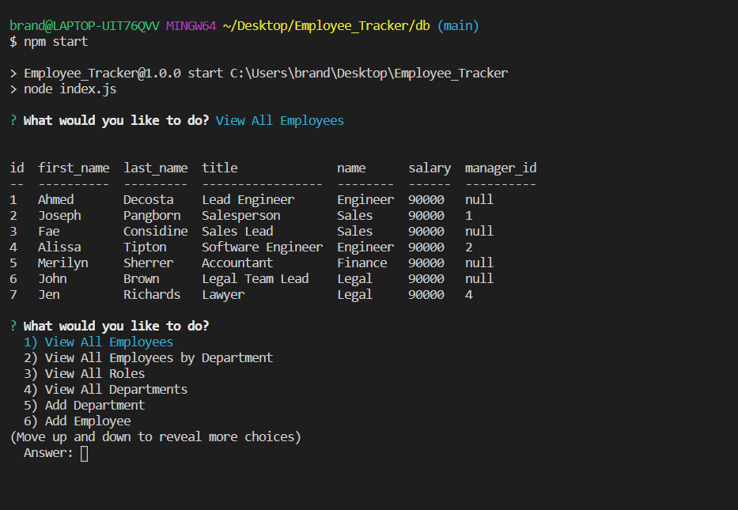

# Employee Tracker

## Description
This project uses MySQL, Node.js, and commandline to access/navigate/and alter the employee database.

## Preview of Expected Results:

## Tutorial
[Click here to view a tutorial video on how to use the Employee Tracker](https:)

## Table of Contents
* [Intallation](#installation)
* [Usage](#usage)
* [License](#license)
* [Contributing](#contributing)
* [Questions](#questions)

## Installation
To install necessary dependencies, run the following command:
~~~
npm i
~~~

## Usage
To start run 'npm start' 

Please Note: At this time, the "Add Employee", "Add Role", and "Update Employee Role" prompts are currently not working properly.

## License 
This project is licensed under the [The Unlicense](http://unlicense.org/) license.

## Contributing
When contributing to this repository, Fork the repo on GitHub, Clone the project to your machine, Commit changes to your own branch, Push your work back up to your fork, then Submit a pull request so your changes can be reviewed.

## Questions
If you have any questions about the repo, open an issue or contact me directly at brandon.l.maxwell@gmail.com. You can find more of my work at [brandon-maxwell](https://github.com/brandon-maxwell).